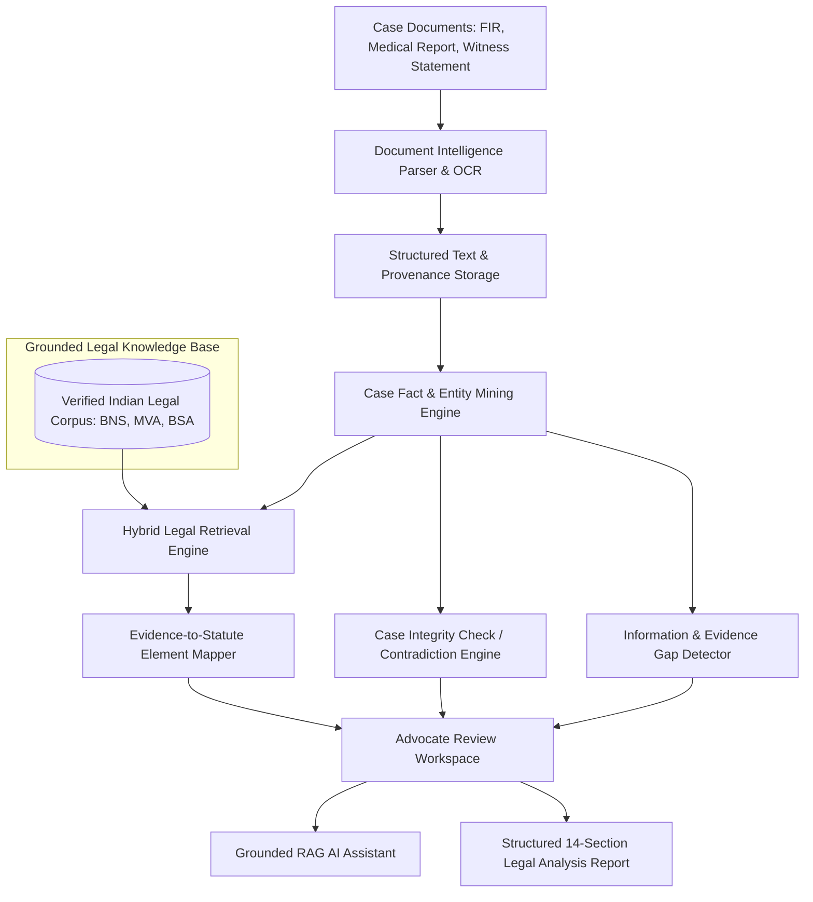

# LexAnalyze

### AI-Assisted Legal Case File Analysis & Evidence Intelligence Platform

[](https://www.python.org/)
[](https://fastapi.tiangolo.com/)
[](https://reactjs.org/)
[](https://www.typescriptlang.org/)
[](LICENSE)

---

## 🏛️ Project Overview

**LexAnalyze** is a complete, production-grade AI-assisted legal case file analysis and evidence intelligence platform designed for advocates, legal researchers, and legal tech professionals. 

When advocates receive massive case files containing FIRs, witness statements, medical reports, panchnama summaries, and charge sheets, manual cross-examination across hundreds of pages is painstaking and error-prone. **LexAnalyze** streamlines this process by:

1. **Extracting Structured Case Facts & Entities** (Accused, Complainant, Victim, Witness, Doctor, Vehicles, Locations, Dates).
2. **Retrieving Potentially Relevant Legal Provisions** from a verified legal knowledge base (Bharatiya Nyaya Sanhita - BNS, Motor Vehicles Act - MVA, Bharatiya Sakshya Adhiniyam - BSA).
3. **Mapping Evidence to Statutory Provisions** (Breaking down required statutory elements vs. evidence found vs. evidence missing).
4. **Performing Automated Case Integrity Checks** (Detecting date discrepancies, 45-minute timestamp variations, and name spelling inconsistencies).
5. **Flagging Information & Forensic Gaps** (Uncollected blood alcohol samples, pending RTO mechanical reports, OCR quality warnings).
6. **Generating Grounded 14-Section Legal Reports** exportable as PDF/JSON.

---

## ⚖️ Critical Legal Safety Requirements

LexAnalyze is an **AI-assisted research tool for advocates, NOT an autonomous lawyer**. To ensure strict legal reliability:

- **Zero Hallucination Guarantee:** The system NEVER invents section numbers, statutes, case citations, judgments, or legal text.
- **Safety Phrasing:** The platform never declares *"Section X definitely applies"*. Instead, it presents provisions as:
  - «*Potentially relevant provision*»
  - «*Retrieved based on the available case facts*»
  - «*Requires advocate verification*»
  - «*The uploaded documents contain evidence relevant to this provision*»
- **Unverified Fallback:** If a provision cannot be verified from the installed authoritative legal knowledge base, the system explicitly reports: *"Unable to verify this provision from the available legal sources."*

---

## 🏗️ System Architecture



---

## 📂 Repository Structure

```
court/
├── backend/
│   ├── app/
│   │   ├── api/          # FastAPI routers (auth, cases, documents, analysis, legal_kb, chat, report)
│   │   ├── core/         # Config, Security (JWT/bcrypt), Database setup
│   │   ├── models/       # SQLAlchemy ORM models & Pydantic schemas
│   │   ├── services/     # OCR, Fact Extractor, Hybrid Legal Retrieval, Evidence Mapper, Contradiction Engine, Gap Detector
│   │   └── main.py       # Main FastAPI application entrypoint
│   ├── requirements.txt
│   └── Dockerfile
├── frontend/
│   ├── src/
│   │   ├── components/   # Navbar, Sidebar, CaseStatusHeader, LegalDisclaimer, DocumentViewerModal
│   │   ├── pages/        # Dashboard, Documents, Facts, Provisions, Mapping, Contradictions, Gaps, Timeline, Report
│   │   ├── context/      # AuthContext
│   │   ├── api/          # API Client
│   │   └── types/        # TypeScript interfaces
│   ├── package.json
│   ├── tailwind.config.js
│   └── Dockerfile
├── legal_knowledge/
│   └── seed_statutes.json # Verified Indian statutes (BNS 281, BNS 125(b), BNS 106, MVA 134, MVA 185, BSA 45)
├── demo_data/            # Fictional sample case file (FIR, Witness Statement, Medical MLC Report, Police Summary)
├── tests/
│   └── test_backend.py   # Pytest suite
├── scripts/
│   └── start_dev.py      # Cross-platform development launcher
├── docker-compose.yml
├── .env.example
├── LICENSE
└── README.md
```

---

## 🚀 Getting Started

### Prerequisites

- Python 3.10+
- Node.js 18+ and npm
- Git

### Quick Start (Local Development)

1. **Clone the repository:**
   ```bash
   git clone https://github.com/your-username/lexanalyze.git
   cd lexanalyze
   ```

2. **Run Python Setup & Tests:**
   ```bash
   python -m pip install -r backend/requirements.txt
   python -m pytest tests/test_backend.py
   ```

3. **Start Development Servers:**
   ```bash
   python scripts/start_dev.py
   ```
   - **Frontend App:** [http://localhost:5173](http://localhost:5173)
   - **FastAPI Backend:** [http://localhost:8000](http://localhost:8000)
   - **Interactive OpenAPI Documentation:** [http://localhost:8000/docs](http://localhost:8000/docs)

---

## 🐳 Docker Deployment

To launch the full stack including PostgreSQL with `pgvector`:

```bash
docker-compose up --build
```

Access the application at `http://localhost:3000`.

---

## 🔬 Demonstration Case Included

LexAnalyze comes pre-loaded with a completely **fictional Indian motor vehicle collision case**:
- **Cause Title:** *State of Maharashtra vs. Rajesh Kumar & Ors.*
- **Reference:** `CR-142/2026`
- **Deliberately Introduced Discrepancies:**
  1. **Time Inconsistency:** FIR states incident occurred at `10:30 PM`, whereas Witness Statement states `11:15 PM` (45-min gap).
  2. **Date Inconsistency:** FIR lists incident as `10 July 2026`, whereas Police Summary header lists `11 July 2026`.
  3. **Name Variations:** FIR records `Rajesh Kumar`, Witness records `Rajesh K.`, Medical report records `Rajesh Kumarr`.
  4. **Missing Forensic Evidence:** Medical MLC records that Blood Alcohol Content (BAC) sample was *NOT collected* due to non-availability of vials.

---

## 🛡️ Privacy & Security

- **Confidential User Data:** Uploaded case files are treated as confidential.
- **No Third-Party Model Training:** Data processed is never used for AI model training.
- **Environment Isolation:** Secrets and API keys are isolated via environment variables (`.env`).
- **Audit Logging:** System operations maintain detailed audit trails.

---

## 📄 Legal Disclaimer

*LexAnalyze provides AI-assisted document analysis and legal research support. It does not provide legal advice or replace professional legal judgment. Legal provisions, interpretations, and case findings must be independently verified by a qualified legal professional.*

---

## 📜 License

Distributed under the [MIT License](LICENSE).
